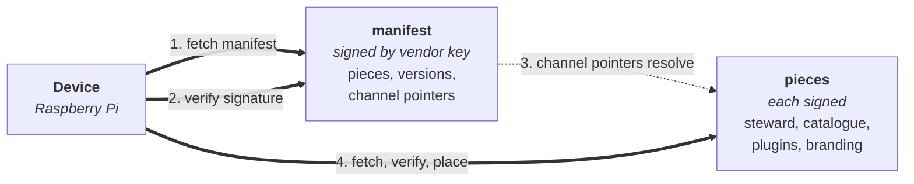

# evo-device-volumio-artefacts

> The release plane for [evo-device-volumio](https://github.com/foonerd/evo-device-volumio). Every byte a device ever pulls, in one place.

Manifest in. Signed bytes out. Devices pick the channel.

This repository is the device-facing surface of the Volumio distribution. Release timing is decoupled from development: editing documentation in the source repository does not touch these assets. What lands here is exactly what a Raspberry Pi running evo-device-volumio fetches and verifies.

## What lives here

Empty today. The brand-neutral plugins that originally targeted Milestones 3-5 in this distribution migrated to [evo-plugins-audio](https://github.com/foonerd/evo-plugins-audio); their signed bytes will live in [evo-plugins-audio-artefacts](https://github.com/foonerd/evo-plugins-audio-artefacts) instead. First content here is the first Volumio-specific piece (the planned candidate is a metadata plugin that integrates with Volumio's existing metadata pipeline). The release-plane contract (manifest schema, signature format, directory layout) is awaiting evo-core; the publish pipeline waits on that contract landing.

## Channels

Three named tracks of release readiness: `dev`, `test`, `prod`.

-   **A channel is a pointer, not a bucket.** A version of a piece is built once, signed once, stored once. Promotion from `dev` to `test` is a manifest edit - the channel's pointer now names that version. The bytes do not change; the signature does not change. Bit-identical artefacts across every channel they appear on.
-   **Selection is per-piece, per-device.** A device's channel map says, for each piece: which channel's pointer do you track? The map is first-class device state. A developer iterating on one plugin can track `dev` for that plugin and `prod` for everything else.
-   **Rollback is a pointer move.** Re-promote a prior version to the same channel. No rebuild. No re-signing of the artefact. The pointer moves back; devices pick it up on their next CHECK.

## Consuming artefacts

Devices fetch the manifest first, verify its signature against the vendor's public key (installed during first bootstrap), then fetch each piece the manifest names at the version the tracked channel points at. Every piece is signature-verified before it is placed into the evo filesystem footprint.

See the source repo's [BUILD.md](https://github.com/foonerd/evo-device-volumio/blob/main/BUILD.md) section 7 for the first install and section 9 for the update flow.

## Publishing artefacts

Three workflows in the source repository write to this repository:

-   **Continuous dev** - on code commits to the source repo, automatically builds, signs, and publishes to the `dev` channel.
-   **Manual build** - on manual dispatch, builds a chosen git reference and publishes to the chosen channel. Used for hotfixes and deliberate rebuilds.
-   **Promotion** - on manual dispatch, edits channel pointers in the manifest and re-signs the manifest. No rebuild.

Workflow shapes, triggers, and trade-offs live in the source repo's [SHOWCASE.md](https://github.com/foonerd/evo-device-volumio/blob/main/SHOWCASE.md) section 7.

## Signing and trust

The vendor signs every artefact with their private key. Devices verify against the vendor's public key, which is distributed as part of the distribution's trust material. The framework does not sign for devices; operator trust is placed in the vendor.

Specific signing tool, key management process, and signature format are tracked as deferred items. They will be chosen when the first signature is cut at Milestone 3. See the source repo's [SHOWCASE.md](https://github.com/foonerd/evo-device-volumio/blob/main/SHOWCASE.md) section 10 for the trust posture at concept level.

## Status

Empty. Populated by the release workflows once two preconditions are met: (a) the release-plane contract lands in evo-core, (b) the first Volumio-specific piece is authored. Brand-neutral pieces this distribution admits (`org.evoframework.*` plugins) ship via [evo-plugins-audio-artefacts](https://github.com/foonerd/evo-plugins-audio-artefacts), not this repository.

## Related

-   [foonerd/evo-device-volumio](https://github.com/foonerd/evo-device-volumio) - the source repository this release plane serves.
-   [foonerd/evo-plugins-audio-artefacts](https://github.com/foonerd/evo-plugins-audio-artefacts) - the brand-neutral audio plugin commons release plane; consumed by this distribution.
-   [foonerd/evo-core](https://github.com/foonerd/evo-core) - the framework.

## License

Apache 2.0. See [LICENSE](LICENSE).
